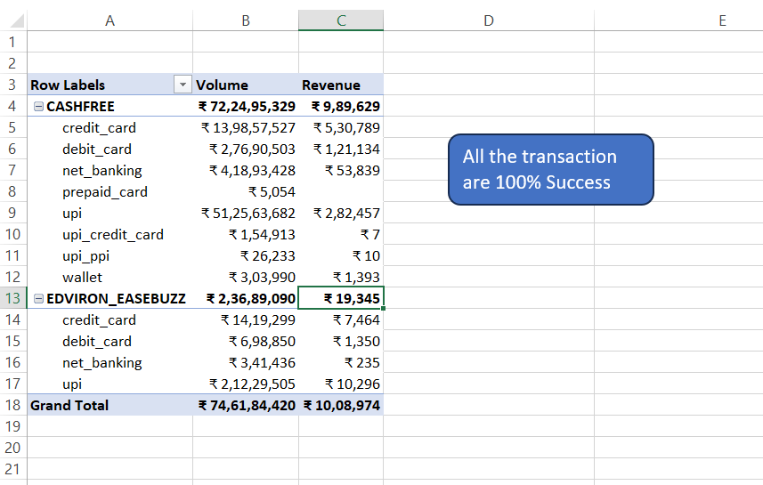

# Edviron Revenue & Payment Analytics Dashboard

## Project Overview
This project was completed as part of a real-world business analytics assessment provided by Edviron.

The objective of the project was to analyze ERP-wise revenue, partner performance, transaction settlements, gateway performance, and payment trends using Excel-based analytics and dashboarding techniques.

The project focuses on transforming raw transaction-level data into actionable business insights through data cleaning, KPI calculations, pivot analysis, and interactive dashboards.

---

## Tools & Technologies Used
- Microsoft Excel
- Pivot Tables
- Power Pivot
- Data Cleaning
- Business Analysis
- Dashboard Development
- KPI Reporting
- Revenue Analysis

---

## Key Business Analysis Performed

### Revenue Analysis
- Calculated ERP Revenue
- Calculated Edviron Net Revenue
- Calculated Edviron Gross Revenue
- Converted pricing percentages into INR values
- Analyzed daily, weekly, and monthly revenue trends

### Partner Performance Analysis
- Compared ERP-wise partner performance
- Identified top-performing partners
- Analyzed revenue contribution across partners

### Payment & Gateway Analysis
- Gateway-wise transaction analysis
- Payment method performance tracking
- Pending vs Settled payment comparison
- Transaction trend monitoring

### Dashboard Reporting
- Built interactive dashboards using Pivot Tables and charts
- Created KPI cards for business metrics
- Developed visual reports for revenue and operational insights

---

## Key Insights Generated
- Identified top revenue-generating ERP systems
- Compared gateway and payment method performance
- Tracked settlement efficiency and pending payments
- Evaluated partner contribution to overall revenue
- Monitored business revenue trends over time

---

## Dashboard Pages Included
1. Daily-Weekly-Monthly Revenue Analysis
2. Partner (ERP-wise) Performance Analysis
3. Gateway-wise & Payment Method Analysis
4. Pending vs Settled Report
5. Executive Dashboard

---

## Revenue Logic Used

ERP Revenue = Merchant Fees − Partner Fees

Edviron Net Revenue = Partner Fees − Edviron Buying (Gateway Fees)

Edviron Gross Revenue = ERP Revenue + Edviron Net Revenue

---

## Project Highlights
- Worked with real-world structured business datasets
- Applied business logic for revenue calculations
- Created professional KPI dashboards
- Performed data transformation and analytical reporting
- Built interactive visualizations for decision-making support

---

## Learning Outcome
This project helped strengthen practical skills in:
- Business analytics
- Revenue reporting
- Dashboard design
- Data interpretation
- Excel-based analytics
- KPI tracking
- Real-world problem solving

## Analysis
## Executive Dashboard

## ERP Performance Analysis
 Performance.png)

!Daily-Weekly-Monthly_revenue.png

## Gateway & Payment Analysis

